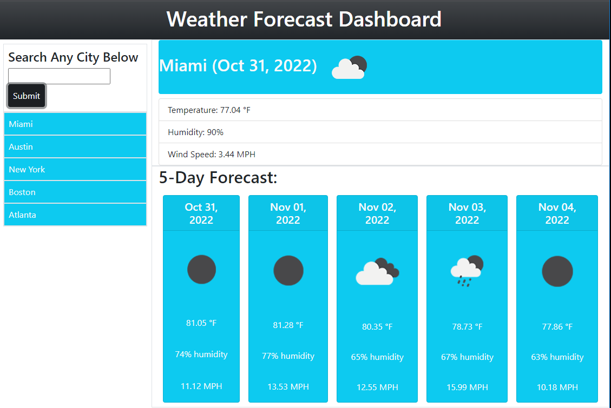

# Weather App 

Current weather and 5-day forecaster App using API

# Features for the App 
-----------------------------------------------------------------------  
  - Promts user to input a city and presents the current and future weather conditions for that city. When user searches for another city the previous city is added to     the search history.
  - User’s input displyed with the city name, the date, an icon representation of weather conditions, the temperature, the humidity, and the wind speed
  - View future weather conditions for that city with a 5-day forecast that displays the date, an icon representation of weather conditions, the temperature, the wind speed, and the humidity
  - When user click on a city in the search history the app to presented with current and future conditions for that city.

# Api's used:
-----------------------------------------------------------------------
​# [open weather API] (https://openweathermap.org/api)

# Links
-----------------------------------------------------------------------
### [Deployed Website](https://micky-ad.github.io/Weather-App/)
### [Repository](https://github.com/Micky-Ad/Weather-App)

# Screenshot:
----------------------------------------------------------------------

 

# Usage:
----------------------------------------------------------------------
​ Current and 5 day weather forcast

# Built with
-----------------------------------------------------------------------
 - Html
 - Css
 - Javascript
 - Bootstrap
 - Jquery
 - Moment.js

# License:
-----------------------------------------------------------------------
MIT License

  Copyright (c) [2022]

Permission is hereby granted, free of charge, to any person obtaining a copy of this software and associated documentation files (the "Software"), to deal in the Software without restriction, including without limitation the rights to use, copy, modify, merge, publish, distribute, sublicense, and/or sell copies of the Software, and to permit persons to whom the Software is furnished to do so, subject to the following conditions:

The above copyright notice and this permission notice shall be included in all copies or substantial portions of the Software.

THE SOFTWARE IS PROVIDED "AS IS", WITHOUT WARRANTY OF ANY KIND, EXPRESS OR IMPLIED, INCLUDING BUT NOT LIMITED TO THE WARRANTIES OF MERCHANTABILITY, FITNESS FOR A PARTICULAR PURPOSE AND NONINFRINGEMENT. IN NO EVENT SHALL THE AUTHORS OR COPYRIGHT HOLDERS BE LIABLE FOR ANY CLAIM, DAMAGES OR OTHER LIABILITY, WHETHER IN AN ACTION OF CONTRACT, TORT OR OTHERWISE, ARISING FROM, OUT OF OR IN CONNECTION WITH THE SOFTWARE OR THE USE OR OTHER DEALINGS IN THE SOFTWARE.
